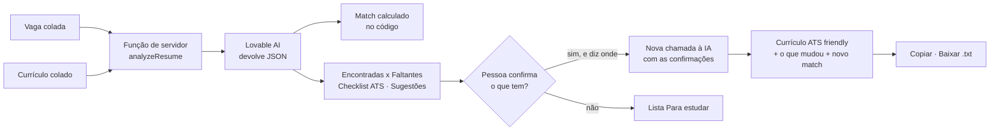

# MatchVaga ATS 🎯

> Compare seu currículo com a vaga, veja o match, descubra as palavras-chave que faltam e gere uma versão ATS friendly, **sem inventar nada que você não fez**.

Projeto do desafio da DIO de construção de uma aplicação no **Lovable** a partir de um mega prompt em Markdown, com foco em **estágio e primeiro emprego em tecnologia**.

🔗 **Aplicação publicada:** [career-cv-optimizer.lovable.app](https://career-cv-optimizer.lovable.app)


---

## Sumário

1. [O problema](#1-o-problema)
2. [Como a análise funciona](#2-como-a-análise-funciona)
3. [O mega prompt e o que mudou nele](#3-o-mega-prompt-e-o-que-mudou-nele)
4. [Ajustes pedidos depois da primeira geração](#4-ajustes-pedidos-depois-da-primeira-geração)
5. [Exemplo de uso](#5-exemplo-de-uso)
6. [Telas](#6-telas)
7. [Arquitetura e código](#7-arquitetura-e-código)
8. [Privacidade e segurança](#8-privacidade-e-segurança)
9. [Como rodar localmente](#9-como-rodar-localmente)
10. [Próximos passos](#10-próximos-passos)

---

## 1. O problema

Grande parte das empresas usa um **ATS (Applicant Tracking System)** para filtrar e ranquear candidatos antes de qualquer pessoa do RH ler um currículo. O ATS procura na vaga termos, ferramentas e competências e verifica se eles aparecem no currículo, de preferência com as mesmas palavras e numa estrutura que ele consiga ler.

Quem mais sofre com isso é quem está começando: estudantes e candidatos a estágio ou primeiro emprego em TI. Muitas vezes eles **têm** as competências (de cursos, projetos acadêmicos, bootcamps), mas descrevem de um jeito genérico ("conhecimentos em banco de dados") ou usam formatos que o ATS não lê bem (tabelas, colunas, ícones). O currículo é bom e para antes do RH.

O MatchVaga resolve isso em três passos: mostra **quanto** o currículo combina com a vaga, **o que** está faltando e entrega uma **versão reescrita**, pronta para copiar ou baixar.

### A regra da aplicação

> **O MatchVaga melhora como você se apresenta. Ele nunca inventa experiência, curso ou ferramenta que você não tem.**

A regra aparece na interface em três lugares (alerta no topo, acima do currículo gerado e no rodapé) e está nas instruções enviadas à IA (`src/lib/analyze.functions.ts`). Palavras-chave que faltam e não têm evidência no currículo **não entram** no currículo ajustado: vão para a lista **"Para estudar"**, a menos que a pessoa confirme que tem e diga onde usou.

## 2. Como a análise funciona



1. **Entrada.** A pessoa cola a descrição da vaga e o currículo em texto, de 200 a 8.000 caracteres cada, com contador. No computador os campos ficam lado a lado; no celular, em abas. O botão **Carregar exemplo** preenche uma vaga e um currículo fictícios.
2. **Validação.** A função de servidor `analyzeResume` valida os textos com **zod** antes de qualquer chamada à IA.
3. **Chamada à IA.** O servidor envia a vaga e o currículo ao **Lovable AI** com instruções fixas: extrair de 12 a 24 palavras-chave da vaga em quatro grupos (**hard skills**, **ferramentas**, **soft skills** e **requisitos**), marcar cada uma como *obrigatória* ou *desejável* e procurar no currículo um trecho que comprove cada uma (inclusive por sinônimo).
4. **Leitura da resposta.** A IA devolve um JSON. O servidor extrai o objeto (`parseJsonAnswer`) e normaliza cada campo (`sanitize`), para que uma resposta malformada não quebre a tela.
5. **Match.** Calculado no código (`calcMatch` em `src/lib/matchvaga.ts`), não pela IA, para ser explicável:
   - obrigatória vale **peso 2**, desejável vale **peso 1**;
   - `match = pontos encontrados ÷ pontos possíveis × 100`, arredondado;
   - até 49% **Baixo**, 50–74% **Médio**, 75% ou mais **Alto**.
6. **Resultado.** Palavras-chave em verde (encontradas, com o trecho que comprova) e âmbar (faltantes), estrela nas obrigatórias, checklist ATS em acordeão (títulos padrão, contatos no topo, datas legíveis, sem tabelas/colunas/ícones, tamanho) e até 6 sugestões priorizadas.
7. **Confirmação.** Para cada faltante, a pessoa marca "Eu tenho…" e escreve onde usou. O que fica desmarcado aparece na lista **Para estudar**, atualizada na hora.
8. **Geração.** Uma segunda chamada envia as confirmações. A IA reescreve o currículo em coluna única, nas seções *Dados de contato, Objetivo, Formação, Competências, Projetos, Experiência, Cursos e Idiomas*, e lista o que mudou.
9. **Saída.** Currículo ajustado, painel **O que mudou**, **novo match** e os botões **Copiar texto**, **Baixar .txt** e **Nova análise**.

## 3. O mega prompt e o que mudou nele

O prompt final está em [`docs/mega-prompt.md`](docs/mega-prompt.md). Ele foi escrito e revisado numa IA generativa antes de ir para o Lovable, e colado no **modo Plan**. Define as quatro etapas do fluxo, o design system **shadcn/ui**, a paleta, o contrato JSON da resposta da IA, a regra de não inventar e o que fica fora do escopo.

### Evolução do prompt até a versão final

| Versão | Mudança | Motivo |
|---|---|---|
| v1 | Pedia "uma nota de compatibilidade" calculada pela IA | A nota mudava a cada análise do mesmo texto |
| v2 | Match calculado no código, com pesos por obrigatória/desejável | Resultado reprodutível e explicável na tela |
| v2 | Contrato JSON explícito para a resposta da IA | Evitar respostas em texto livre difíceis de exibir |
| v3 | Etapa de confirmação "Eu tenho isso" + lista "Para estudar" | Aproveitar termos que faltam sem violar a regra de não inventar |
| v3 | Foco em estágio e primeiro emprego em TI | Nicho claro, com exemplo e dicas específicos |

### O que o Lovable entregou diferente do prompt

| Pedido no prompt | O que foi construído | Avaliação |
|---|---|---|
| Edge function `analyze` no Lovable Cloud | Função de servidor `analyzeResume` do TanStack Start, chamando o Lovable AI Gateway pelo Vercel AI SDK | Mantido: mesmo efeito (chave só no servidor) com menos peças |
| Saída estruturada via tool calling | Resposta em JSON lido por `parseJsonAnswer` + normalização em `sanitize` | Mantido, com a normalização como proteção extra |
| Contador âmbar perto do limite | Contador âmbar enquanto o texto está **abaixo** do mínimo de 200 | Mantido: ajuda mais quem ainda está colando o texto |

## 4. Ajustes pedidos depois da primeira geração

Os ajustes foram pedidos no chat do Lovable, alguns selecionando o elemento na tela e pedindo a mudança só nele. Os prompts estão em [`docs/ajustes.md`](docs/ajustes.md).

| # | Ajuste | Por quê |
|---|---|---|
| 1 | Loading em 3 etapas com esqueleto do resultado | A análise leva alguns segundos e a tela parecia travada |
| 2 | Mensagens claras para erros da IA (429, 402, 403 e formato inesperado) | Em erro, o loading ficava infinito e a pessoa não sabia o que fazer |
| 3 | Leitura tolerante do JSON da IA | Às vezes a resposta vinha dentro de bloco de código e quebrava a tela |
| 4 | Abas "Vaga / Currículo" no celular | Os dois campos lado a lado não cabiam no mobile |
| 5 | Botão "Carregar exemplo" | Quem abre pelo portfólio testa em um clique |
| 6 | Lista "Para estudar" ao vivo na confirmação | Deixar visível o que **não** vai entrar no currículo |
| 7 | "O que mudou" e "Novo match" ao lado do currículo | A pessoa precisa conferir que nada foi inventado |
| 8 | Título, descrição e imagem social na publicação | Link bonito ao compartilhar e base para SEO |

## 5. Exemplo de uso

Um caso completo, com a vaga e o currículo do botão **Carregar exemplo**, está em [`docs/exemplo-de-uso.md`](docs/exemplo-de-uso.md). Ele mostra o cálculo do match passo a passo e o currículo antes e depois, e deixa claro por que o match **não** sobe inventando React ou Docker.

## 6. Telas

| Entrada | Resultado da análise |
|---|---|
|  |  |

| Checklist e sugestões | Confirmação |
|---|---|
|  |  |

| Currículo ajustado | Celular |
|---|---|
|  |  |

## 7. Arquitetura e código

| Camada | Tecnologia |
|---|---|
| Framework | TanStack Start (React 19 + Vite), TypeScript |
| Interface | Tailwind CSS v4 + **shadcn/ui**, ícones lucide-react, avisos sonner |
| IA | Lovable AI Gateway via Vercel AI SDK (`ai`, `@ai-sdk/openai`) |
| Validação | zod, no servidor |

Arquivos principais:

| Arquivo | Papel |
|---|---|
| `src/routes/index.tsx` | Página única: entrada, resultado, confirmação e currículo final |
| `src/lib/analyze.functions.ts` | Função de servidor `analyzeResume`: validação, instruções da IA e normalização da resposta |
| `src/lib/ai.server.ts` | Chamada ao Lovable AI (só no servidor) e tradução dos erros |
| `src/lib/matchvaga.ts` | Tipos, regra do app, limites, `calcMatch`, `matchLabel` e dados de exemplo |
| `src/components/matchvaga/` | `RuleAlert`, `MatchScore`, `KeywordBoard`, `AtsChecklistPanel`, `ConfirmStep`, `ResumeOutput` |
| `src/styles.css` | Tema com a paleta (índigo, verde, âmbar, vermelho) e modo escuro |

A documentação técnica completa está em [`DOCUMENTACAO.md`](DOCUMENTACAO.md).

## 8. Privacidade e segurança

- **Nada é salvo.** Sem login, sem banco de dados, sem histórico. O texto vai ao servidor só para a análise.
- A tela avisa para não colar CPF, RG ou endereço completo.
- A chave da IA (`LOVABLE_API_KEY`) existe só como variável de ambiente no servidor. **Nenhuma chave está versionada**, e o `.gitignore` bloqueia arquivos `.env`.

## 9. Como rodar localmente

```bash
bun install
bun run dev
```

A análise precisa da variável `LOVABLE_API_KEY` no servidor, que o Lovable fornece automaticamente. Localmente, sem ela, a tela abre mas a análise mostra "Serviço de IA não configurado".

## 10. Próximos passos

- [ ] Exportar o currículo em **PDF** de coluna única com texto selecionável (legível por ATS)
- [ ] Exportar também em **.docx**, para editar antes de enviar
- [ ] Histórico das análises em banco de dados, com login
- [ ] E-mail de confirmação de cadastro com o conector Resend
- [ ] Dashboard da evolução do match entre versões do currículo
- [ ] SEO e GEO (otimização para buscas feitas por IAs)

## Autor

**Eduardo Lucas Lemes Januario** · Gestão de Tecnologia da Informação · IFSP Catanduva
