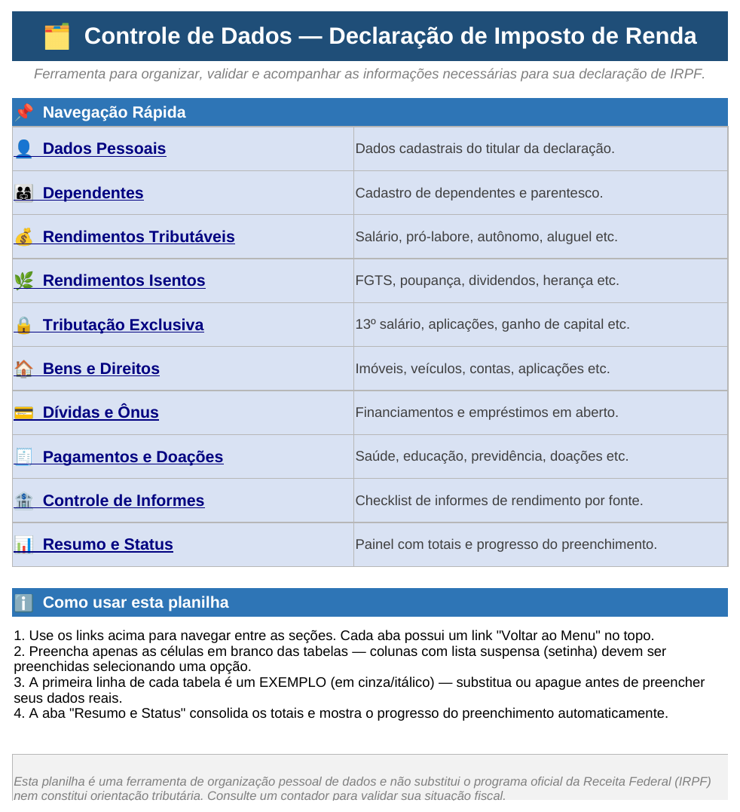
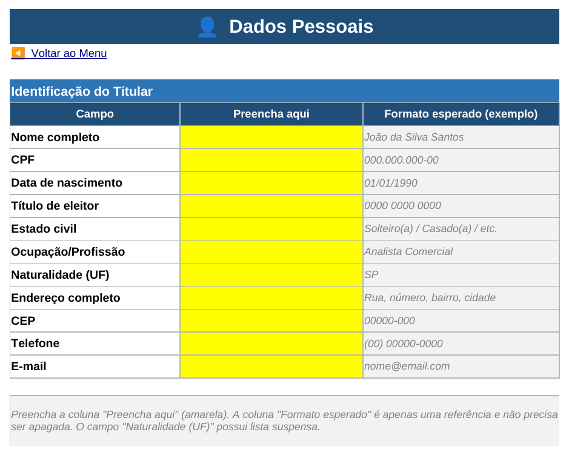
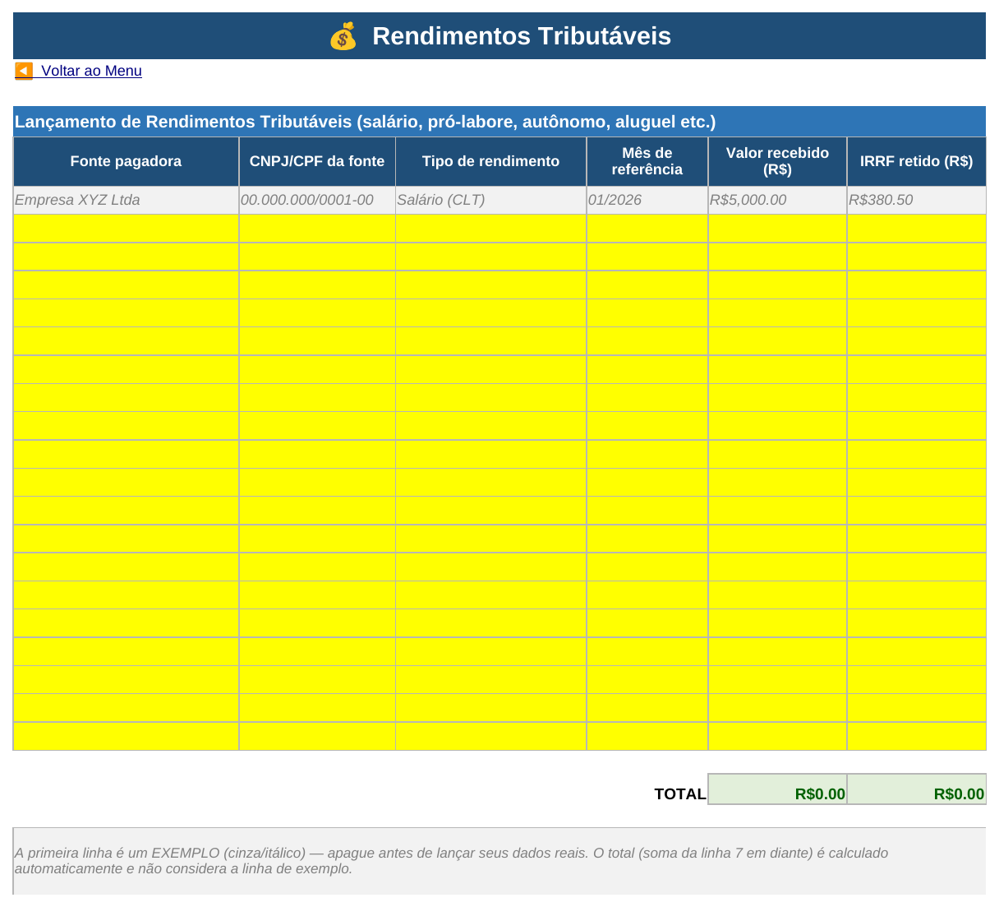
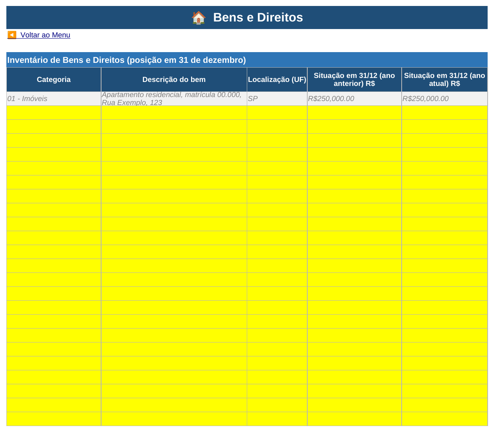
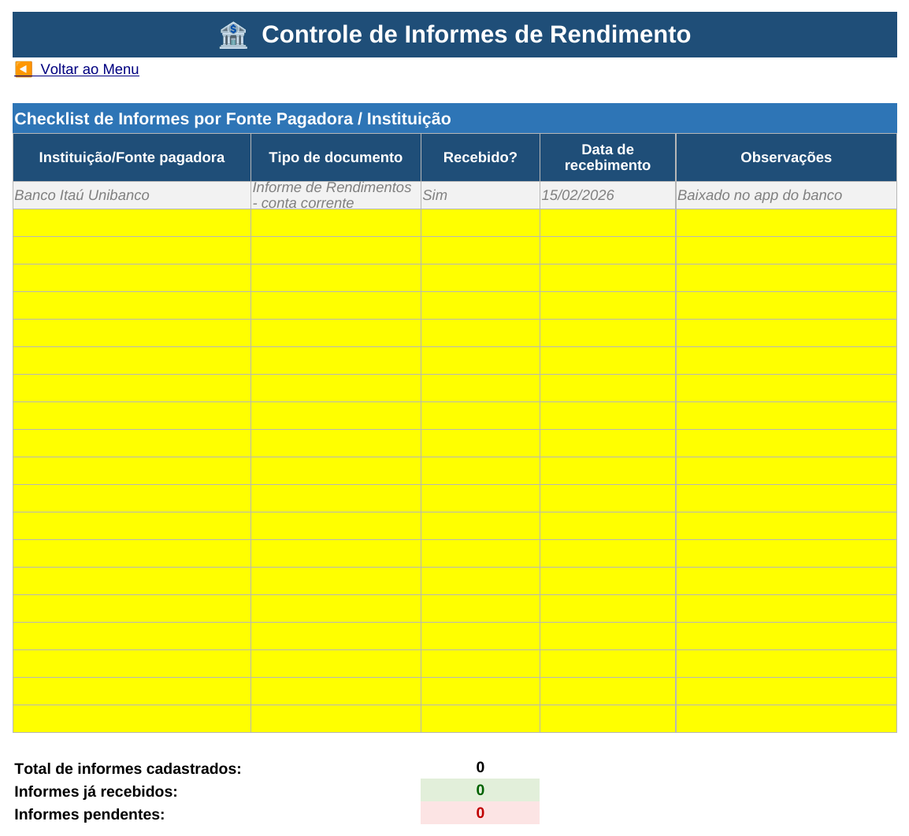
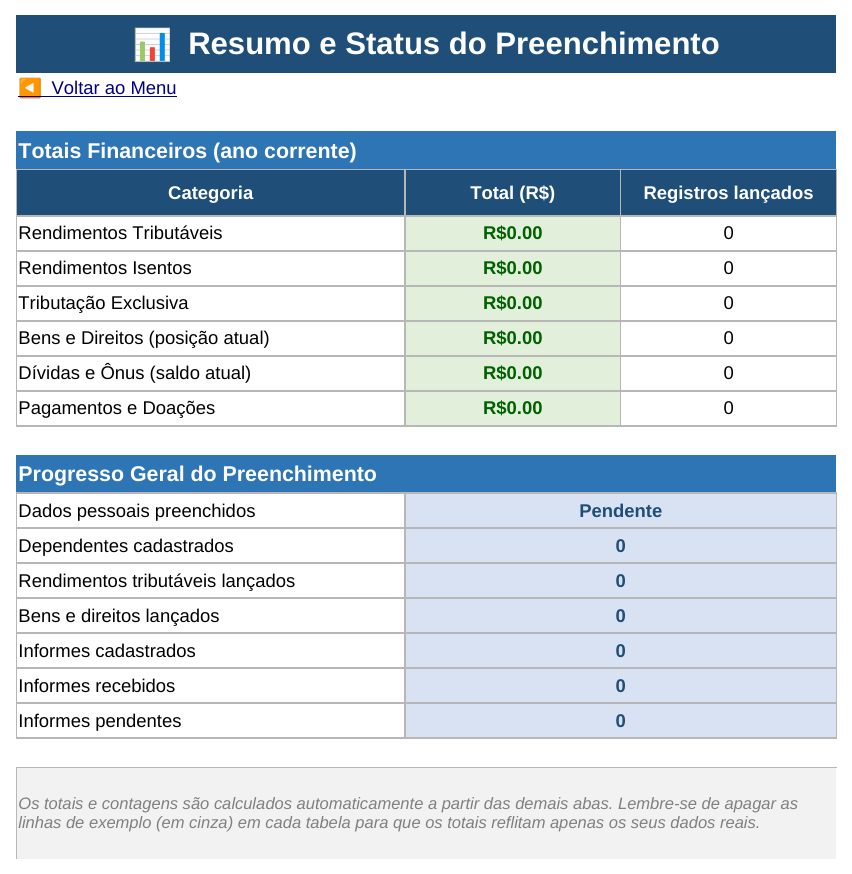

# 🗂️ Controle de Dados — Declaração de Imposto de Renda

Projeto desenvolvido como desafio prático do bootcamp **DIO — Excel**, aplicando conceitos de validação de dados, navegação facilitada e funções interativas para construir uma ferramenta de organização de informações fiscais para a declaração de Imposto de Renda de Pessoa Física (IRPF).

## 📌 Sobre o projeto

A planilha funciona como um **agregador de dados fiscais**: um único arquivo Excel onde o usuário centraliza, ao longo do ano, todas as informações que normalmente precisa garimpar em bancos, corretoras, empregador e recibos na época da declaração — evitando o corre-corre de março/abril.

O modelo foi pensado com três pilares:

- **Navegação facilitada** — um menu central com links diretos para cada seção, e um link de retorno em cada aba;
- **Validações automáticas** — colunas críticas usam listas suspensas (categoria de bem, tipo de rendimento, UF, banco, sim/não), reduzindo erros de digitação e padronizando os lançamentos;
- **Funcionalidades extras** — total calculado automaticamente por categoria, checklist de recebimento de informes de rendimento por instituição, e um painel de status que mostra o progresso do preenchimento.

## 🗂️ Estrutura da planilha

O arquivo [`Controle_IR_Declaracao.xlsx`](./Controle_IR_Declaracao.xlsx) contém 11 abas visíveis (mais uma aba de listas auxiliares oculta):

| Aba | Conteúdo |
|---|---|
| **Menu** | Painel de navegação com links para todas as seções e instruções de uso |
| **DadosPessoais** | Dados cadastrais do titular (nome, CPF, endereço, naturalidade com lista de UF etc.) |
| **Dependentes** | Cadastro de dependentes, com lista suspensa de grau de parentesco |
| **RendTributaveis** | Salário, pró-labore, autônomo, aluguel — com tipo por lista suspensa e total automático |
| **RendIsentos** | FGTS, poupança, dividendos, herança, indenizações etc. |
| **RendExclusiva** | 13º salário, aplicações financeiras, ganho de capital, PLR etc. |
| **BensDireitos** | Inventário de bens (categoria por lista suspensa), com posição em 31/12 do ano anterior e do ano atual |
| **DividasOnus** | Financiamentos e empréstimos, com saldo devedor anterior e atual |
| **Pagamentos** | Saúde, educação, previdência privada, doações e pensão alimentícia |
| **Informes** | Checklist de recebimento dos informes de rendimento por banco/fonte pagadora, com contadores de pendências |
| **Resumo** | Dashboard consolidado: totais por categoria e progresso geral do preenchimento |
| **Listas** *(oculta)* | Listas de apoio (UF, bancos, categorias etc.) que alimentam as validações de dados |

### Como usar

1. Abra o arquivo `Controle_IR_Declaracao.xlsx` e comece pela aba **Menu**.
2. Clique em cada link para navegar até a seção correspondente; use o link **"◀ Voltar ao Menu"** no topo de cada aba para retornar.
3. Preencha apenas as **células amarelas**. Colunas com seta de lista suspensa devem ser preenchidas selecionando uma opção da lista.
4. A **primeira linha de cada tabela é um exemplo** (em cinza/itálico) — apague-a ou sobrescreva-a antes de lançar seus dados reais.
5. Acompanhe o progresso do preenchimento e os totais na aba **Resumo**, atualizados automaticamente.

## 🎯 Objetivos de aprendizagem aplicados

- Aplicação de **validação de dados** (listas suspensas) alimentadas por intervalos nomeados em uma aba de apoio oculta;
- Construção de **navegação interna** por hiperlinks entre abas, sem uso de macros;
- Uso de fórmulas (`SUM`, `COUNTA`, `COUNTIF`, `IF`) para totais automáticos e um painel de status/progresso;
- Formatação condicional para destacar visualmente pendências (ex.: informes não recebidos);
- Documentação técnica do processo para compartilhamento via GitHub.

## 🧩 Detalhes técnicos

- **Listas suspensas**: implementadas com `Dados > Validação de Dados`, referenciando intervalos nomeados (ex.: `UF`, `BANCOS`, `CATEGORIA_BENS`) definidos na aba oculta **Listas**. Isso facilita expandir ou editar as opções sem mexer nas fórmulas de validação.
- **Totais automáticos**: cada tabela financeira soma sua coluna de valor (ex.: `=SOMA(F7:F25)`), ignorando a linha de exemplo.
- **Painel de status**: a aba Resumo usa `CONT.VALORES` e `CONT.SE` para contar registros lançados e informes recebidos/pendentes em tempo real.
- **Formatação condicional**: na aba Informes, a coluna "Recebido?" fica verde quando "Sim" e vermelha quando "Não", dando um retrato visual rápido das pendências.
- **Navegação sem macros**: os "botões" de menu e os links de retorno são hiperlinks internos (`#NomeDaAba!A1`), o que mantém o arquivo mais leve e compatível (não depende de macros/VBA habilitadas).

## 🖼️ Capturas de tela

As capturas abaixo estão disponíveis na pasta [`/images`](./images).

| Menu de navegação | Dados Pessoais |
|---|---|
|  |  |

| Rendimentos Tributáveis | Bens e Direitos |
|---|---|
|  |  |

| Controle de Informes | Resumo e Status |
|---|---|
|  |  |

## ⚠️ Observações importantes

- Esta planilha é uma **ferramenta de organização pessoal de dados** — ela não substitui o programa oficial da Receita Federal (IRPF) nem gera a declaração propriamente dita.
- O conteúdo não constitui orientação tributária. Consulte um contador para validar sua situação fiscal específica.
- Guarde os comprovantes (recibos, notas fiscais, informes de rendimento) correspondentes aos lançamentos: a Receita Federal pode solicitá-los posteriormente.

## 🛠️ Tecnologias utilizadas

- Microsoft Excel (Validação de Dados, Hiperlinks, Formatação Condicional)
- Fórmulas nativas: `SOMA`, `CONT.VALORES`, `CONT.SE`, `SE`
- Boas práticas de organização de planilhas de controle

## 📚 Referências

- Aulas do bootcamp DIO sobre Excel, validação de dados e navegação interativa
- Documentação da Receita Federal sobre categorias de bens, direitos e rendimentos do IRPF

## 📎 Autor

Projeto desenvolvido por **Bruno** como parte do bootcamp DIO.
