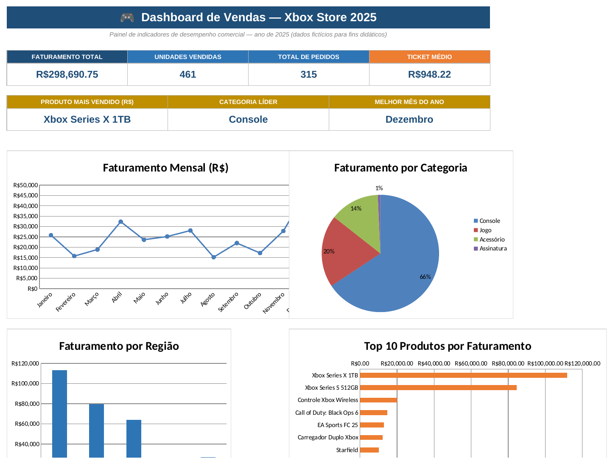
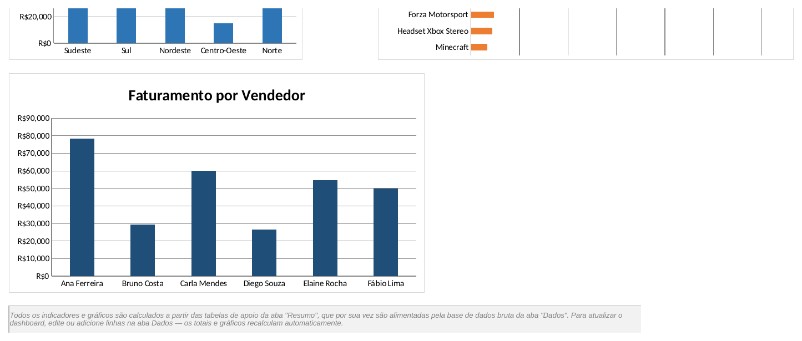
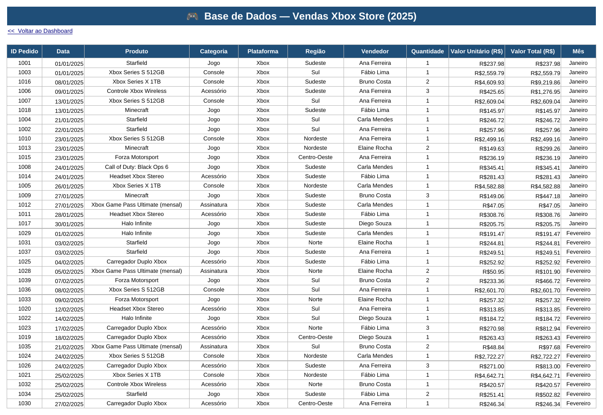
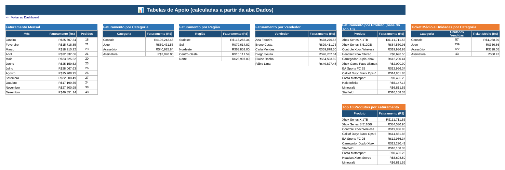

# 🎮 Dashboard de Vendas — Xbox Store 2025

Projeto desenvolvido como desafio prático do bootcamp **DIO — Excel**, com foco em organização e visualização de dados para análise de desempenho comercial.

## 📌 Sobre o projeto

O objetivo foi transformar uma base de dados bruta de vendas em um **dashboard interativo**, com indicadores-chave (KPIs) e gráficos que permitem uma leitura rápida do desempenho comercial de uma loja fictícia especializada em produtos Xbox (consoles, jogos, acessórios e assinaturas).

Todo o dashboard é **100% orientado a fórmulas**: nenhum número está "hardcoded" — desde os totais dos KPIs até os dados de cada gráfico, tudo é calculado a partir da base bruta na aba **Dados**. Isso significa que o arquivo pode ser reutilizado com dados reais: basta substituir/adicionar linhas na base e todo o dashboard se atualiza automaticamente.

## 🗃️ Dados utilizados

Como não tive acesso ao conteúdo binário da base de dados oficial do desafio (`base.xlsx`), gerei uma **base de dados sintética e realista** com as mesmas características de um cenário de vendas de loja de games:

- **315 pedidos** distribuídos ao longo de 12 meses de 2025;
- **12 produtos** em 4 categorias: Console (Xbox Series X/S), Jogo (EA Sports FC 25, Call of Duty, Forza Motorsport, Halo Infinite, Minecraft, Starfield), Acessório (Controle, Headset, Carregador) e Assinatura (Xbox Game Pass Ultimate);
- **5 regiões** do Brasil (Sudeste, Sul, Nordeste, Centro-Oeste, Norte), com maior concentração de vendas no Sudeste;
- **6 vendedores**;
- **Sazonalidade realista**: volume de vendas maior em novembro e dezembro (Black Friday e Natal) do que no restante do ano.

> Se você tiver a base de dados original do desafio, pode substituir o conteúdo da aba **Dados** pelos dados reais (mantendo a mesma estrutura de colunas) que todas as tabelas e gráficos se atualizam automaticamente — veja a seção "Como reproduzir" abaixo.

## 🗂️ Estrutura da planilha

O arquivo [`Dashboard_Vendas_Xbox.xlsx`](./Dashboard_Vendas_Xbox.xlsx) contém 3 abas:

| Aba | Conteúdo |
|---|---|
| **Dados** | Base bruta de vendas (315 linhas): ID do pedido, data, produto, categoria, plataforma, região, vendedor, quantidade, valor unitário e valor total (calculado por fórmula). |
| **Resumo** | Tabelas de apoio que agregam a base bruta por mês, categoria, região, vendedor e produto — usando `SOMASE`/`SOMARPRODUTO`, além de um ranking Top 10 de produtos via `MAIOR` + `ÍNDICE`/`CORRESP`. |
| **Dashboard** | Painel visual com 6 KPIs e 5 gráficos, todos referenciando a aba Resumo. |

### Indicadores (KPIs) do Dashboard

- Faturamento total
- Unidades vendidas
- Total de pedidos
- Ticket médio
- Produto mais vendido (em R$)
- Categoria líder
- Melhor mês do ano

### Gráficos do Dashboard

- **Faturamento mensal** (linha) — evolução do faturamento ao longo dos 12 meses;
- **Faturamento por categoria** (pizza) — participação de Console, Jogo, Acessório e Assinatura;
- **Faturamento por região** (colunas) — desempenho por região do Brasil;
- **Top 10 produtos por faturamento** (barras horizontais) — ranking dos produtos que mais geraram receita;
- **Faturamento por vendedor** (colunas) — desempenho individual da equipe comercial.

## 🖼️ Capturas de tela

| Dashboard — KPIs, faturamento mensal, categoria e Top 10 |
|---|
|  |

| Dashboard — Região e vendedor |
|---|
|  |

| Base de dados bruta |
|---|
|  |

| Tabelas de apoio (Resumo) |
|---|
|  |

## 🧩 Detalhes técnicos

- **Nenhum valor fixo nos indicadores**: todos os KPIs e séries de gráfico usam fórmulas (`SOMA`, `SOMASE`, `SOMARPRODUTO`, `CONT.VALORES`, `MAIOR`, `ÍNDICE`, `CORRESP`) apontando para a aba Dados;
- **Ranking Top 10 dinâmico**: implementado com a combinação `MAIOR` (para pegar o k-ésimo maior valor) + `ÍNDICE`/`CORRESP` (para descobrir a qual produto aquele valor pertence) — uma alternativa compatível com versões mais antigas do Excel, já que funções como `CLASSIFICAR`/`SORT` nem sempre estão disponíveis;
- **Nome do mês independente de idioma**: em vez de `TEXTO(data;"MMMM")` (que depende da configuração regional do Excel), usei `ESCOLHER(MÊS(data);"Janeiro";"Fevereiro";...)`, garantindo que a coluna sempre exiba os meses em português, independentemente do idioma do Excel de quem abrir o arquivo;
- **Faturamento mensal via `SOMARPRODUTO`**: como as datas não estão agrupadas por texto de mês, o total de cada mês é calculado comparando intervalos de data (`>= 1º dia do mês` e `< 1º dia do mês seguinte`), o que lida corretamente com anos diferentes;
- **Gráficos vinculados à aba Resumo, não à aba Dados**: isso mantém os gráficos rápidos e limpos, já que eles leem de tabelas pequenas e já agregadas, em vez de processar as 315 linhas brutas a cada atualização.

## 🔁 Como reproduzir / atualizar com seus próprios dados

1. Abra `Dashboard_Vendas_Xbox.xlsx` e vá até a aba **Dados**;
2. Substitua ou adicione linhas mantendo as mesmas colunas (Data, Produto, Categoria, Região, Vendedor, Quantidade, Valor Unitário);
3. Se os nomes de produtos, categorias, regiões ou vendedores forem diferentes dos usados neste exemplo, atualize também as listas de referência na aba **Resumo** (colunas de rótulo de cada tabela) para que as fórmulas `SOMASE` capturem os novos valores;
4. Recalcule a planilha (`Ctrl+Alt+F9` no Excel, se necessário) — todos os KPIs e gráficos do Dashboard se atualizam automaticamente.

## 🛠️ Tecnologias utilizadas

- Microsoft Excel (fórmulas nativas, gráficos nativos, formatação condicional)
- Fórmulas: `SOMA`, `SOMASE`, `SOMARPRODUTO`, `CONT.VALORES`, `MAIOR`, `ÍNDICE`, `CORRESP`, `ESCOLHER`, `SEERRO`
- Boas práticas de organização de dashboards: separação entre dados brutos, tabelas de apoio e camada visual

## 📚 Referências

- Aulas do bootcamp DIO sobre Excel e construção de dashboards de vendas

## 📎 Autor

Projeto desenvolvido por **Bruno** como parte do bootcamp DIO.
