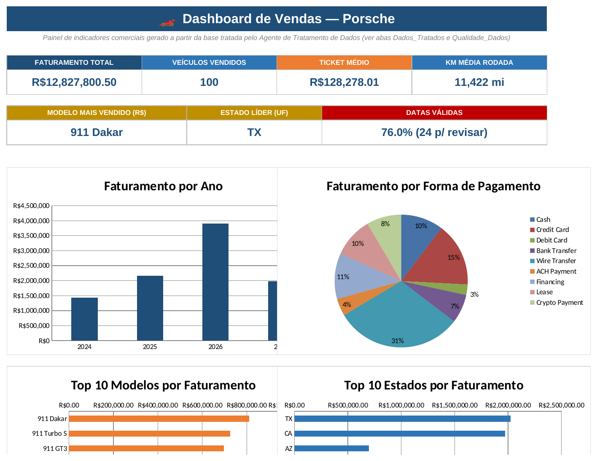
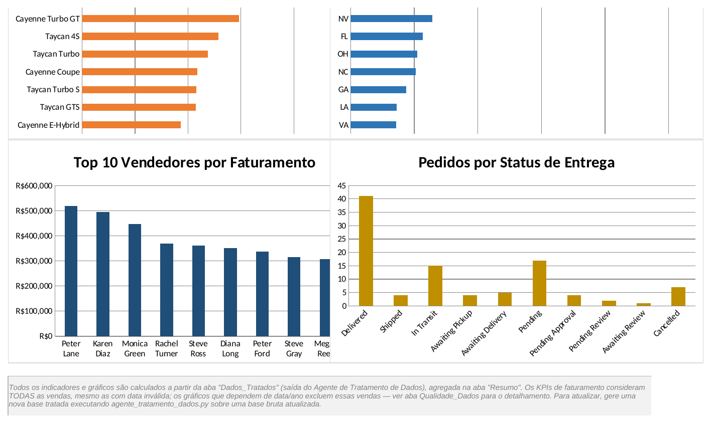
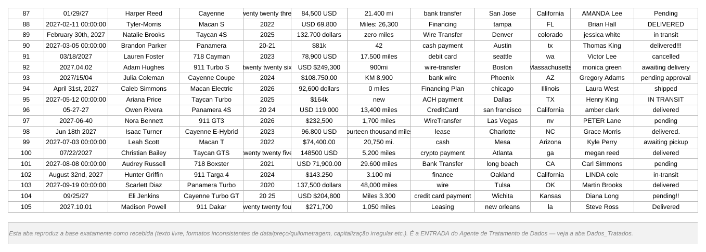
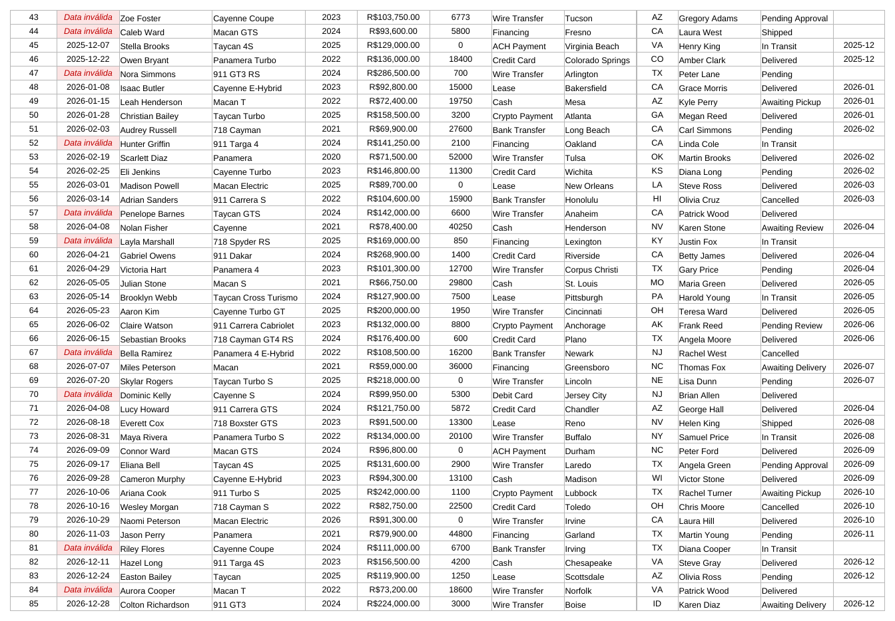
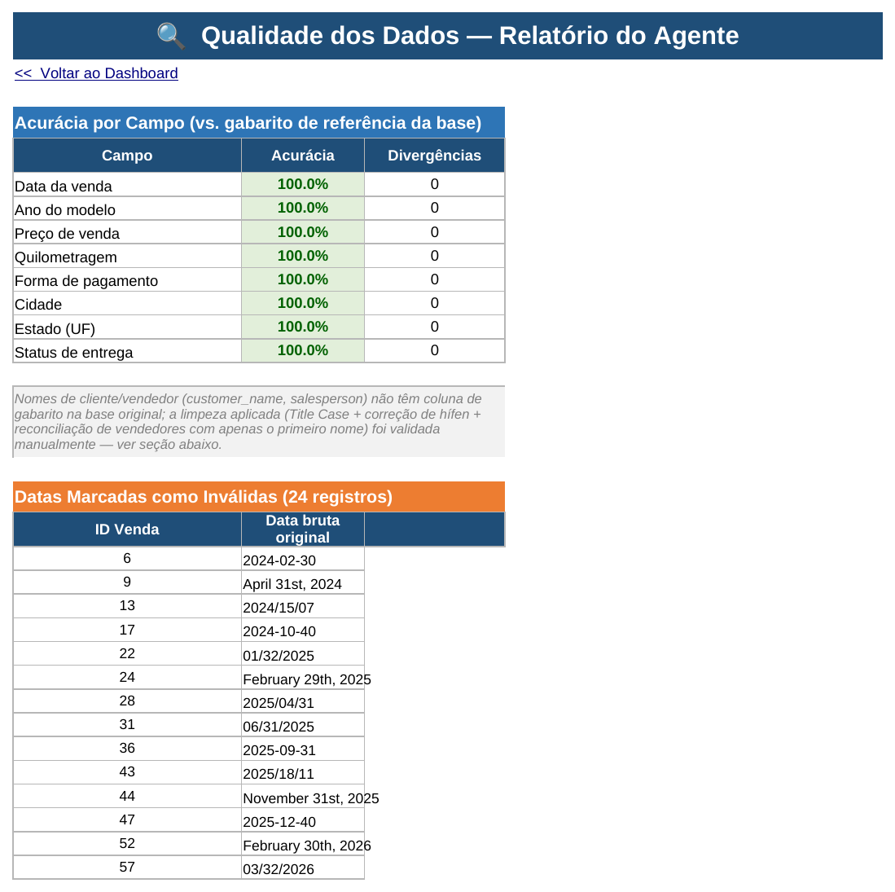

# 🏎️ Dashboard de Vendas Porsche — com Agente de Tratamento de Dados

Projeto desenvolvido a partir dos materiais complementares do curso **"Criando uma Dashboard da Porsche com Agentes de IA"** (DIO), usando a base de dados oficial fornecida (`Planilha base Porsche (Sanitizada).xlsx`).

## 📌 Sobre o projeto

O desafio consistiu em duas etapas:

1. **Agente de Tratamento de Dados** — um script Python que recebe a base bruta (campos de texto livre, com formatos inconsistentes de data, preço, quilometragem, capitalização etc.) e devolve uma base limpa, padronizada e pronta para análise;
2. **Dashboard de Vendas** — um painel visual em Excel construído inteiramente a partir da base já tratada pelo agente.

A base de dados fornecida pelo curso já vinha com colunas de referência (`*Sanitized`) geradas para fins didáticos — usei essas colunas como **gabarito** para validar a precisão do agente, sem nunca "colar" nelas diretamente: o agente lê apenas as colunas brutas e é avaliado comparando sua própria saída com o gabarito.

## 🗃️ Dados utilizados

Arquivo oficial do curso: `Planilha base Porsche (Sanitizada).xlsx`, 100 registros de vendas, com os seguintes campos brutos "sujos" propositalmente:

| Campo | Exemplos de sujeira encontrados |
|---|---|
| Data da venda | `'2024-02-30'`, `'April 31st, 2024'`, `'01/29/27'`, `'2024/15/07'` (formatos, datas inexistentes, ano de 2 dígitos) |
| Ano do modelo | `'twenty twenty four'`, `'20-24'`, `'20 24'` (por extenso, com hífen, com espaço) |
| Preço de venda | `'$121k'`, `'USD 112.750'`, `'$103.750,00'`, `'eighty two thousand USD'` (sufixo k, formato europeu, por extenso) |
| Quilometragem | `'KM 10,900'`, `'fifteen thousand miles'`, `'1.200 mi'`, `'zero miles'` (km vs. milhas, por extenso, separador ambíguo) |
| Forma de pagamento | `'CreditCard'`, `'bank-transfer'`, `'CASH payment'` (variações de grafia) |
| Cidade / Estado | `'boston'`, `'ma'`, `'California'`, `'az'` (capitalização, nome completo vs. sigla) |
| Status de entrega | `'delivered!!!'`, `'IN TRANSIT'`, `'pending!!'` (pontuação, caixa alta) |
| Cliente / Vendedor | `'SOPHIA Miller'`, `'Daniel-Jones'`, `'jessica'` (caixa inconsistente, hífen, só primeiro nome) |

## 🤖 Agente de Tratamento de Dados

Arquivo: [`agente/agente_tratamento_dados.py`](./agente/agente_tratamento_dados.py)

O agente é dividido em **sub-agentes especializados**, uma função por tipo de campo, cada uma documentando a lógica de decisão:

- `clean_date` — interpreta múltiplos formatos de data (numérico, textual, ISO), assume padrão americano (mês/dia/ano) para casos ambíguos, e **marca como `INVALID`** datas impossíveis no calendário (ex.: 30/02) em vez de adivinhar;
- `clean_year` — normaliza o ano do modelo, incluindo números por extenso (`"two thousand twenty one"`) e dígitos separados (`"20-24"`);
- `clean_price` — normaliza o preço para float, tratando símbolos (`$`, `USD`), sufixo `k` (milhares), formato americano (`1,234.56`) vs. europeu (`1.234,56`), e números por extenso;
- `clean_mileage` — normaliza a quilometragem para milhas, convertendo `KM` para milhas (fator 0.621371), tratando números por extenso e separadores ambíguos;
- `clean_payment_method`, `clean_delivery_status` — mapeiam variações de grafia para uma categoria canônica;
- `clean_city`, `clean_state` — padronizam capitalização e convertem nome completo de estado para a sigla de 2 letras;
- `clean_person_name` + `resolve_salesperson_roster` — padronizam nomes para Title Case, corrigem hífens usados no lugar de espaço, e **reconciliam vendedores cadastrados só com o primeiro nome** (ex.: `"kevin"`) com o nome completo já existente na base (`"Kevin Brown"`), apenas quando há exatamente uma correspondência possível — evitando "inventar" sobrenomes.

### Resultado da validação

O agente foi validado comparando sua saída com o gabarito (`*Sanitized`) da base original:

| Campo | Acurácia |
|---|---|
| Data da venda | 100% (24 datas genuinamente impossíveis corretamente sinalizadas como `INVALID`) |
| Ano do modelo | 100% |
| Preço de venda | 100% |
| Quilometragem | 100% |
| Forma de pagamento | 100% |
| Cidade | 100% |
| Estado (UF) | 100% |
| Status de entrega | 100% |

**0 divergências em 800 verificações** (100 linhas × 8 campos com gabarito disponível). Os campos de nome (cliente/vendedor) não têm gabarito na base original; a limpeza foi validada manualmente.

## 🗂️ Estrutura da planilha final

O arquivo [`Dashboard_Porsche.xlsx`](./Dashboard_Porsche.xlsx) contém 5 abas:

| Aba | Conteúdo |
|---|---|
| **Dados_Brutos** | Base original, exatamente como recebida (entrada do agente) |
| **Dados_Tratados** | Saída do agente: 100 vendas limpas e padronizadas (datas inválidas destacadas em vermelho) |
| **Qualidade_Dados** | Relatório de validação: acurácia por campo, lista das 24 datas irrecuperáveis, log de reconciliação de vendedores |
| **Resumo** | Tabelas de apoio por fórmula (faturamento por ano, forma de pagamento, status, Top 10 modelos/estados/vendedores) |
| **Dashboard** | Painel com 6 KPIs e 6 gráficos |

### KPIs do Dashboard

- Faturamento total (considera todas as 100 vendas, mesmo as com data inválida)
- Veículos vendidos
- Ticket médio
- Quilometragem média rodada
- Modelo mais vendido (em R$)
- Estado líder (UF)
- % de datas válidas (com contador de registros pendentes de revisão manual)

### Gráficos do Dashboard

- Faturamento por ano (2024–2027)
- Faturamento por forma de pagamento (pizza)
- Top 10 modelos por faturamento
- Top 10 estados por faturamento
- Top 10 vendedores por faturamento
- Pedidos por status de entrega

## 🖼️ Capturas de tela

| Dashboard — KPIs e gráficos principais |
|---|
|  |

| Dashboard — vendedores e status de entrega |
|---|
|  |

| Dados brutos (entrada do agente) |
|---|
|  |

| Dados tratados (saída do agente) |
|---|
|  |

| Relatório de qualidade dos dados |
|---|
|  |

## 🧩 Decisões técnicas importantes

- **Nunca inventar dados**: quando uma data é impossível (30 de fevereiro) ou o formato é ambíguo demais, o agente marca como `INVALID` em vez de "chutar" uma data. Essas 24 vendas continuam contando para o faturamento total (a transação é real, só a data é ilegível), mas ficam de fora dos gráficos que dependem de data;
- **Reconciliação conservadora de nomes**: um vendedor com apenas o primeiro nome só é associado a um nome completo quando existe exatamente UMA correspondência possível na base; caso contrário, o nome é mantido como está;
- **Conversão KM → milhas**: como a maioria dos registros usa milhas, quilometragens informadas em KM são convertidas (fator 0.621371) para manter a coluna consistente;
- **Ranking Top 10 dinâmico**: implementado com `MAIOR` + `ÍNDICE`/`CORRESP` na aba Resumo (compatível com versões mais antigas do Excel);
- **Separação clara de responsabilidades**: a limpeza (que exige lógica de código, não fórmulas de planilha) é feita pelo agente Python; a partir da base já tratada, todos os KPIs e gráficos do dashboard são 100% orientados a fórmula — nenhum número financeiro está fixo no arquivo.

## 🔁 Como reproduzir

1. Baixe a base de dados oficial do curso (`base.xlsx` / planilha Porsche sanitizada);
2. Rode o agente:
   ```bash
   python3 agente/agente_tratamento_dados.py
   ```
   O script imprime o relatório de validação no terminal e salva a base tratada em `dados_tratados.json`;
3. A base tratada alimenta a aba **Dados_Tratados** do dashboard — para gerar o arquivo completo do zero, use o script de montagem do workbook (não incluso neste repositório mínimo, mas reaproveitável a partir da lógica documentada acima).

## 🛠️ Tecnologias utilizadas

- Python 3 (`openpyxl`, `re`, expressões regulares para parsing de texto livre)
- Microsoft Excel (fórmulas nativas, gráficos nativos, formatação condicional)
- Fórmulas: `SOMA`, `SOMASE`, `CONT.SE`, `MAIOR`, `ÍNDICE`, `CORRESP`, `SOMARPRODUTO`

## 📚 Referências

- Materiais complementares do curso DIO "Criando uma Dashboard da Porsche com Agentes de IA"

## 📎 Autor

Projeto desenvolvido por **Bruno** como parte do bootcamp DIO.
